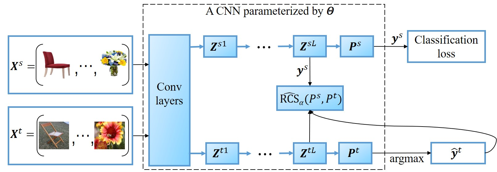

# Domain Neural Adaptation (DNA)
**IEEE Transactions on Neural Networks and Learning Systems 2022** 

This repository contains a paper with supplementary material for the deep domain adaptation approach DNA. A pytorch implementation of the DNA approach will also be included a few months later (due to concerns with some on-going related works).

In a nutshell, DNA solves the joint distribution mismatch problem in deep domain adaptation for large scale image recognition. To this end, it exploits a Convolutional Neural Network (CNN) to match the source and target joint distributions in the network representation space under the Relative Chi-Square (RCS) divergence. The following figure illustrates this deep joint distribution matching idea.



##### Tested on
* Python 3.8
* PyTorch 1.11.0
* CUDA 11.4

##### How to run

```bash
python  main_for_UDA.py --dataset officehome --source Product   --target Clipart   --phase pretrain --gpu 0 --start_update_step 2000 --update_interval 1000 --steps 70000 --message "JOINT" --alpha_div 0.5 --beta_div 0 --lambda_div 0.1 --patience 10
python main_for_UDA.py --dataset officehome --source Product   --target Clipart   --phase train --gpu 0 --start_update_step 2000 --update_interval 1000 --steps 70000 --message "JOINT" --alpha_div 0.5 --beta_div 0 --lambda_div 0.1 
```


For more details of this domain adaptation approach,  please refer to the following IEEE TNNLS work: 

@article{Chen2022Domain,  
  author={Chen, Sentao and Hong, Zijie and Harandi, Mehrtash and Yang, Xiaowei},  
  journal={IEEE Transactions on Neural Networks and Learning Systems},   
  title={Domain Neural Adaptation},   
  year={2022},  
  volume={},  
  number={},  
  pages={1-12},  
  doi={10.1109/TNNLS.2022.3151683}  
  }